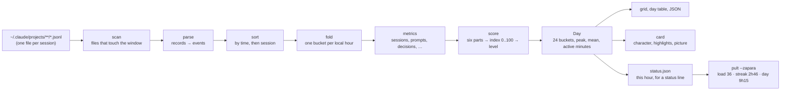

# How the numbers are made

zapara reads the transcripts Claude Code writes on your machine and turns them
into one number per hour, the load index, plus a few numbers per day. This page
walks that path once, from a line in a `.jsonl` file to `load 36` in a status
line. The specs under `docs/superpowers/specs/` are the authority; this page is
the map.



The shell is the scan, the CLI, the card's picture step and the status-file
writer: they touch the file system and the clock. From `parse` to `Day` the
code is pure: `analyze()` takes transcript text already in memory and a window
with an explicit `now`, and returns `Day[]`. Nothing is sent anywhere, and no
message text survives past `parse`.

## 1. Which files are read

`scan` walks `~/.claude/projects/**/*.jsonl` (or `--projects <dir>`) and skips
`subagents/` directories, so a subagent's own transcript never counts. A file
is read when its modification time falls inside the window, or, when it does
not, when the last timestamp in its final 64 KB does: a restored or synced file
is not dropped because the file system calls it old. Nothing from that tail is
kept.

The window is the days you asked for plus a 3-hour look-back before it. The
look-back exists for one thing: a presence streak that began before the window
is measured from where it began, up to three hours back. A streak older than
that is floored at what the look-back sees, the one documented approximation;
the index is not affected, because its streak component saturates at 120
minutes.

## 2. From records to events

`parse` reads a transcript line by line. Each line is a JSON record with a
`type`, a `timestamp`, a `sessionId` and a `message`; a malformed line is
skipped, never fatal, and a sidechain record (`isSidechain: true`) is ignored for
every kind. A record becomes zero or more events. Message text is
compared against a few fixed markers and discarded: an event carries a time, a
session id, a kind and, for output, a token count.

| Event | What it is in the transcript |
|---|---|
| `prompt` | A `user` record, not `isMeta`, whose text (a string, or the first text block, which a pasted image can push behind an `image` block) is neither an interrupt marker nor an agent-message marker. Something the human typed. |
| `report` | A `user` record, not `isMeta`, whose text (a string, or the first text block) starts with an agent-message marker such as `<teammate-message` or `<task-notification>`. Something the human reads and reacts to, but did not type. |
| `output` | An `assistant` record with a text block and `usage.output_tokens`, counted once per `requestId`. Model output the human reads. |
| `interrupt` | A `user` text block starting with `[Request interrupted by user`. |
| `reject` | A `tool_result` saying the user did not want to proceed with that tool use. |
| `question` | An `AskUserQuestion` tool call in an assistant message. |
| `plan_review` | An `ExitPlanMode` tool call in an assistant message. |
| `mode_change` | A `permission-mode` record. It has no timestamp, so it takes the time of the last timestamped record before it in the same file, or, when there is none yet, is attributed to the first timestamped record that follows; it is dropped only if the file has none. The first such record in a file is the session's baseline; each later one whose mode differs from the previous is one switch, and repeats count nothing. |
| `activity` | Every `user` or `assistant` record with a timestamp, `isMeta` included. It says a session is alive, and nothing more. |

The exact markers and shapes are in the design spec's "Events" table.

## 3. Hours and buckets

Time is local. Every event belongs to the bucket named by its local date and
hour, so a day is 24 buckets `00`..`23`. On a DST fall-back day two wall-clock
hours share one label and merge; on a spring-forward day one label stays empty.

All events from all files are sorted by time, then session id, then position,
before anything is derived. "Consecutive" below means consecutive in that
order, across sessions. Events in the look-back update the presence streak and
nothing else; they are never bucketed.

## 4. What each hour counts

`fold` walks the sorted events once and accumulates, per bucket:

| Metric | Definition |
|---|---|
| `sessions` | Distinct session ids with at least one `activity` event in the hour. The one metric that counts agents' work: a session is alive whoever is typing. |
| `prompts` | Number of `prompt` events. |
| `reports` | Number of `report` events. |
| `outputTokens` | Sum of tokens over `output` events. |
| `decisions` | `interrupts + rejects + questions + plans + modeSwitches`. |
| `contextSwitches` | Over the hour's prompts in time order, consecutive pairs from different sessions. |
| `streakMin` | Length of the presence streak that contains the hour's last prompt, from that streak's first prompt, which may lie in an earlier hour or in the look-back. |
| `activeMin` | Five times the number of 5-minute slots in the hour covered by presence. |
| `lateNight` | The hour is one of 23, 0, 1, 2, 3, 4, 5. |

Presence is the human's. A presence streak is a run of consecutive `prompt`
events in which no two neighbours are more than 10 minutes apart. Every prompt
covers its own 5-minute slot, and two neighbouring prompts of one streak cover
every slot between them, because the human sat through that gap too. A slot
belongs to the hour its start falls in. Assistant records and inbound reports
between two prompts bridge nothing: an agent that works on while you are away
neither keeps your streak alive nor fills your day. This is the rule since
0.3.1; before it, any record counted.

## 5. The index

Each hour with at least one live session gets six components in `[0, 1]`,
each a count divided by a norm and clamped, weighted into points of 100:

```
parallel    = clamp((sessions - 1) / 4)                                   # 1 session → 0, 3 → 0.5, 5+ → 1
pace        = clamp(prompts / 20)                                         # 10 prompts/hour → 0.5, 20+ → 1
supervision = clamp((3 * decisions + reports + contextSwitches) / 45)     # 15 decisions alone → 1; 45 reports alone → 1
reading     = clamp(outputTokens / 80000)                                 # 40k → 0.5, 80k+ → 1
streak      = clamp(streakMin / 120)                                      # 60 min → 0.5, 2h+ → 1
late        = lateNight ? 1 : 0

index = round(25*parallel + 15*pace + 30*supervision + 10*reading + 10*streak + 10*late)
```

Levels: 0–29 Calm, 30–59 Warming, 60–84 Heating, 85–100 Fried. Without the
late-night flag the index tops out at 90.

A worked hour: 2 sessions, 8 prompts, 2 decisions, 6 reports, 1 context
switch, 30 000 output tokens, a streak of 45 minutes, at 14:00.

| Part | Computation | Points |
|---|---|---|
| parallel | (2 − 1) / 4 = 0.25 × 25 | 6.25 |
| pace | 8 / 20 = 0.4 × 15 | 6.00 |
| supervision | (3·2 + 6 + 1) / 45 = 0.289 × 30 | 8.67 |
| reading | 30 000 / 80 000 = 0.375 × 10 | 3.75 |
| streak | 45 / 120 = 0.375 × 10 | 3.75 |
| late | 0 × 10 | 0 |
| **index** | round(28.42) | **28, Calm** |

The index is rounded once, from the unrounded sum; the parts that `--explain`
prints are rounded to one decimal for display, so they can add up to a number
one off from the index while the index is right. Weights, norms and level
bounds live in one constant in `src/score.ts`; a recalibration is one diff
there plus a CHANGELOG line. The norms are the p90 of two weeks of real data
on two machines; the design spec's "Index" section says why each is what it is.

## 6. What a day adds up to

A `Day` is its 24 buckets plus `peak` (the highest index), `mean` (the mean
index over hours with a live session, rounded), both `null` on a day with none;
`activeMin`, the sum of the hours' active minutes; and `totals`, the sums of
every count and the largest `sessions` of any hour.

A day that includes now is a snapshot: the run fixes `now` when it starts,
records it as `asOf`, and counts nothing timestamped after it, even if Claude
Code appends records while the run reads. The next run makes the next
snapshot. The tables end with `as of HH:MM, this hour is still running`.

## 7. Where the numbers go

**The grid** (`zapara`, `--days`, `--from`/`--to`) is one glyph per hour by
level, seven days by default, with the day's peak and active minutes at the
end of each row. **The day table** (`zapara today`, a date) is one row per
active hour with the counts above; `--explain` adds the six parts. A pipe gets
JSON with the same fields, `mean` included.

**The card** (`zapara card`) takes the grid's window flags, 14 days by default,
and names one of four characters by which parts of the index carried that
window: The Conductor (parallel and
pace), The Supervisor (supervision and reading), The Marathoner (streak), The
Night Owl (late). Each share is that character's points as a fraction of the
most it could have had; the highest wins, ties in that order. The highlights
are ranked against norms in `src/card.ts` that order a picture and never enter
the index. The card spec has the rest.

**The status file** (`zapara status`) writes today's current hour to
`~/.claude/zapara/status.json` as one line of JSON with nine fields:

```json
{"schema":1,"asOf":"2026-09-19T12:30:38.300Z","date":"2026-09-19","hour":15,"index":36,"level":"Warming","peak":41,"activeMin":555,"streakMin":166}
```

`hour`, `index`, `level` and `streakMin` are the current hour's; `peak` and
`activeMin` are the day's. A status line such as [pult](https://github.com/drakulavich/pult)
reads that file on every render and shows `load 36 · streak 2h46 · day 9h15`:
the index in the colour of its level, the time since your last ten-minute
break, and the day's presence so far. When the file is older than five minutes
the reader starts `zapara status` in the background and reads the fresh file
on the next render. The status-file spec holds the format and the reader's
contract.

## 8. Things that look like bugs and are not

- **A calm index in a busy-looking hour.** Explicit decisions are rare in auto
  mode, so the index leans on supervision and reading: what a heavy hour costs
  is reacting to reports, hopping between sessions and reading output. Check
  `--explain`.
- **A streak of 1 minute after a long day.** The streak is the run you are in
  now, not the day's longest; the longest is on the card. Eleven minutes without
  a prompt of yours start a new one.
- **Fewer active minutes than the session felt.** Minutes count when you were
  present, not when an agent was working alone. The `sess` column still shows
  the agents.
- **Yesterday's numbers changed today.** A file restored or synced late is
  read by its last record, not its modification time; and a later run of a day
  that was still running makes a later snapshot.
- **No message text anywhere.** By design: text is compared against fixed
  markers and dropped, and the CLI never prints a path, not even the projects
  root when it cannot open it.

## Where to read next

- `docs/superpowers/specs/2026-09-17-zapara-design.md`: events, buckets, metrics, the index, the CLI.
- `docs/superpowers/specs/2026-09-18-zapara-card-design.md`: the card's data and picture.
- `docs/superpowers/specs/2026-09-19-zapara-status-file-design.md`: the status file and the reader's contract.
- `src/score.ts`: the one place weights, norms and levels live.
- `CHANGELOG.md`: every calibration and rule change, with its reason.
